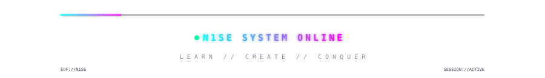

<div align="center">





Building my foundations in software engineering through  
algorithms, systems, databases and real-world projects.

<br><br>


<br><br>

<a href="https://github.com/CODENAME-N1SE">

</a>

<a href="https://www.linkedin.com/in/nirmalsemalti/">

</a>

</div>

<br>

```text
┌──[ N1SE@github ]─[ ~/identity ]
│
├── USER       :: Nirmal Semalti
├── CODENAME   :: N1SE
├── FOCUS      :: Software Engineering
├── DSA        :: Intermediate
├── STATUS     :: Building. Learning. Evolving.
│
└── MOTTO      :: Learn. Create. Conquer.
```

<div align="center">


<!-- CURRENTLY_BUILDING:START -->

### ⚡ BANK MANAGEMNET

`Multiple / Not detected` • `ACTIVE DEVELOPMENT`

Python-based banking management system using OOP and SQL for account and transaction management.

```text
STATUS       :: BUILDING
LAST SIGNAL  :: 18 AUG 2026
SOURCE       :: GITHUB
```

[](https://github.com/CODENAME-N1SE/Bank-Managemnet)

<!-- CURRENTLY_BUILDING:END -->

</div>

<br>

<details>

<summary><b>⚡ 01 // TECH_ARSENAL.exe</b></summary>

<div align="center">


<code>&gt; LOADING CORE MODULES...</code>

<br>


</div>

```text
┌──[ N1SE@github ]─[ ~/tech_arsenal ]
│
├── LANGUAGES
│   ├── Python
│   ├── C
│   └── Java
│
├── WEB
│   ├── HTML
│   └── CSS
│
├── DATABASE
│   └── SQL
│
├── CORE
│   ├── Data Structures & Algorithms [INTERMEDIATE]
│   └── Object-Oriented Programming
│
└── TOOLS
    ├── Git
    └── GitHub
```


</details>

<br>

<details>

<summary><b>🗃️ 02 // LATEST_PROJECTS</b></summary>

<div align="center">


<code>&gt; QUERYING LATEST REPOSITORIES...</code>

</div>

<br>

<!-- LATEST_PROJECTS:START -->

### `[01]` ⚡ BANK MANAGEMNET

```text
LANGUAGE     :: Multiple / Not detected
STATUS       :: PUBLISHED
LAST UPDATE  :: 18 AUG 2026

DESCRIPTION ::
Python-based banking management system using OOP and SQL for account and transaction management.
```

[](https://github.com/CODENAME-N1SE/Bank-Managemnet)

<br>

### `[02]` ⚡ FILE HANDLING PROJECT USING PYTHON

```text
LANGUAGE     :: Python
STATUS       :: PUBLISHED
LAST UPDATE  :: 04 JUL 2026

DESCRIPTION ::
No description provided yet.
```

[](https://github.com/CODENAME-N1SE/File-Handling-Project-Using-Python)

<br>

### `[03]` ⚡ HYBRID CPU SCHEDULER

```text
LANGUAGE     :: C
STATUS       :: PUBLISHED
LAST UPDATE  :: 28 MAY 2026

DESCRIPTION ::
Hybrid CPU Scheduling Algorithm in C featuring Real-Time, Interactive, and Batch process handling with preemption, aging, waiting time, and turnaround time calculation.
```

[](https://github.com/CODENAME-N1SE/Hybrid-CPU-Scheduler)

<br>

### `[04]` ⚡ MOVIE MANAGEMENT SYSTEM

```text
LANGUAGE     :: C
STATUS       :: PUBLISHED
LAST UPDATE  :: 28 MAY 2026

DESCRIPTION ::
A simple Movie Ticket Booking System developed in C using Data Structures concepts. The project uses a 2D array to manage seat allocation, booking, cancellation, and availability checking. File handling is implemented to store booking data permanently.
```

[](https://github.com/CODENAME-N1SE/Movie-Management-System)

<br>

```text
N1SE://PROJECT_DATABASE

04 LATEST PROJECTS LOADED

> DATABASE QUERY COMPLETE_
```

<!-- LATEST_PROJECTS:END -->

</details>

<br>

<details>

<summary><b>🎯 03 // CURRENT_MISSION</b></summary>

<br>

```yaml
DEVELOPMENT:
  - Strengthen Data Structures & Algorithms
  - Build larger real-world applications
  - Improve software architecture
  - Write cleaner and maintainable code
  - Strengthen problem-solving ability

NEXT_TARGETS:
  - JavaScript
  - PostgreSQL
  - REST APIs
  - FastAPI
  - Docker

LONG_TERM:
  - Backend Development
  - Software Engineering
  - Full-stack Fundamentals
```

</details>

<br>

<details>

<summary><b>📡 04 // DEVELOPER_TELEMETRY</b></summary>

<br>

```text
N1SE://DEVELOPER_SIGNAL

PROFILE STATUS    :: ONLINE
PRIMARY LANGUAGES :: Python / C
CURRENT FOCUS     :: Software Engineering
DSA LEVEL         :: Intermediate

SIGNAL SOURCE     :: GitHub Activity
SYSTEM STATE      :: BUILDING
```

<div align="center">

<a href="https://github.com/CODENAME-N1SE?tab=repositories">

</a>

<a href="https://github.com/CODENAME-N1SE?tab=overview">

</a>

</div>

</details>

<br>

<div align="center">

<h3>🐍 // CONTRIBUTION_STREAM</h3>

<code>&gt; CONSUMING CONTRIBUTION DATA...</code>

<br><br>

<picture>
  <source
    media="(prefers-color-scheme: dark)"
    srcset="https://raw.githubusercontent.com/CODENAME-N1SE/CODENAME-N1SE/gh-pages/github-contribution-grid-snake-dark.svg"
  />
  <source
    media="(prefers-color-scheme: light)"
    srcset="https://raw.githubusercontent.com/CODENAME-N1SE/CODENAME-N1SE/gh-pages/github-contribution-grid-snake.svg"
  />
  
</picture>

<br>

<sub><code>N1SE://CONTRIBUTION_MATRIX ACTIVE</code></sub>

</div>

<br>

<div align="center">

<h3>// ESTABLISH_CONNECTION</h3>

<a href="https://www.linkedin.com/in/nirmalsemalti/">

</a>

<a href="https://github.com/CODENAME-N1SE">

</a>

<br><br>



</div>
